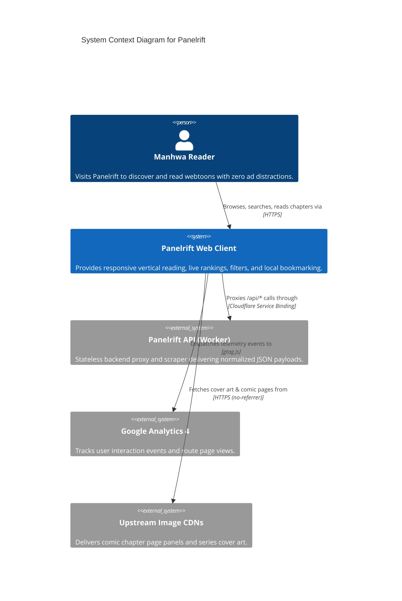
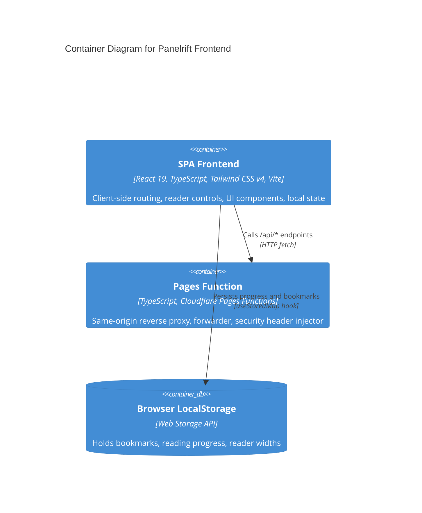
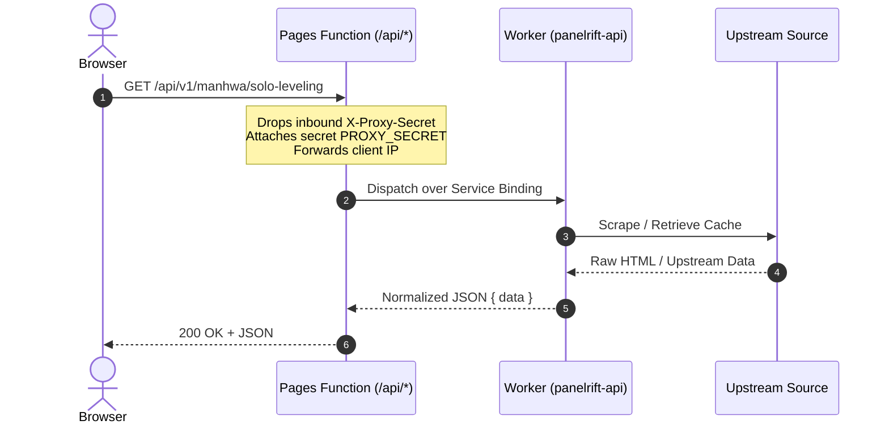
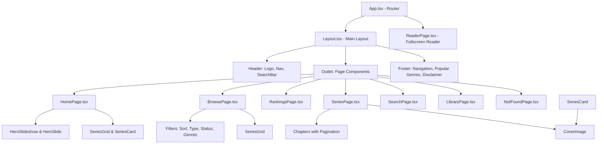

# Panelrift Architecture Documentation

This document outlines the high-level architecture, system components, data flows, and design decisions for the **Panelrift** web client.

---

## 1. System Overview

Panelrift is a high-performance web client built for discovering, browsing, and reading manhwa and webtoons. It is deployed as a single-page application (SPA) on Cloudflare Pages, consuming data from the headless `manhwa-api` worker over internal Cloudflare service bindings.

```mermaid
graph TD
    User([Reader / Browser]) -->|HTTPS Requests| CFP[Cloudflare Pages: panelrift]
    CFP -->|Static Assets & Hydration| SPA[React 19 Frontend App]
    CFP -->|/api/* Requests| PF[Pages Function: functions/api/[[path]].ts]
    PF -->|Internal Service Binding API| CFW[Cloudflare Worker: panelrift-api]
    CFW -->|Scraping & Upstream Caching| Upstream[(Upstream Providers / CDNs)]
    SPA -->|Local Storage Cache| LS[(Browser LocalStorage)]
    SPA -->|Telemetry Events| GA[Google Analytics 4 & GTM]
```

---

## 2. C4 Architecture Models

### 2.1 Level 1: System Context Diagram



### 2.2 Level 2: Container Diagram



---

## 3. Data Flow & Proxy Architecture

### 3.1 Same-Origin Zero-CORS Gateway

The browser **never** calls the backend worker's public URL directly. All requests are routed through `/api/*` on the same domain:



### 3.2 Benefits of Service Binding Architecture
1. **Zero CORS Overhead**: Browser communicates exclusively with its own origin (`https://panelrift.eu.cc`).
2. **Internal Network Dispatch**: Requests travel over Cloudflare's private backbone rather than the public internet.
3. **Hidden Worker**: The backend worker can run with `workers_dev = false`, eliminating public endpoint exposure.
4. **Client IP Forwarding**: Pages Functions preserve `CF-Connecting-IP`, preventing the entire site from sharing a single IP rate-limiting bucket.

---

## 4. Frontend Component Hierarchy



---

## 5. Performance & Core Web Vitals Strategy

### 5.1 Largest Contentful Paint (LCP)
- The active hero slideshow cover (`rank === 1`) on the Home Page and the series cover on the Series Detail Page explicitly use `fetchPriority="high"` and `eager`.
- Background, inactive carousel slides use `fetchPriority="low"` and `eager={false}` to prevent network contention.

### 5.2 Cumulative Layout Shift (CLS)
- All card images and reader page slots reserve exact aspect ratios (`aspect-2/3`) before images decode.
- Skeleton components render identical dimensional footprints to incoming API data.

### 5.3 Interaction to Next Paint (INP)
- Search inputs use a two-tier debouncing model (`typed` state reflects immediate keystrokes; `term` debounces API requests by `SEARCH_DEBOUNCE_MS`).
- Filter updates and scroll events are throttled and run inside passive event listeners.

---

## 6. Client-Side Privacy & Storage Architecture

Panelrift is intentionally stateless with no user registration. User data is stored locally:

- **Key `panelrift:bookmarks:v1`**: Stored as a hash map of bookmarked series keyed by slug.
- **Key `panelrift:progress:v1`**: Stored as reading progress keyed by slug, containing `chapterId`, `chapterNumber`, and `read_at` timestamp.
- **Cross-Tab Synchronization**: Custom `EventTarget` dispatches local change events within the same tab, while native `storage` events synchronize changes across multiple open tabs.
